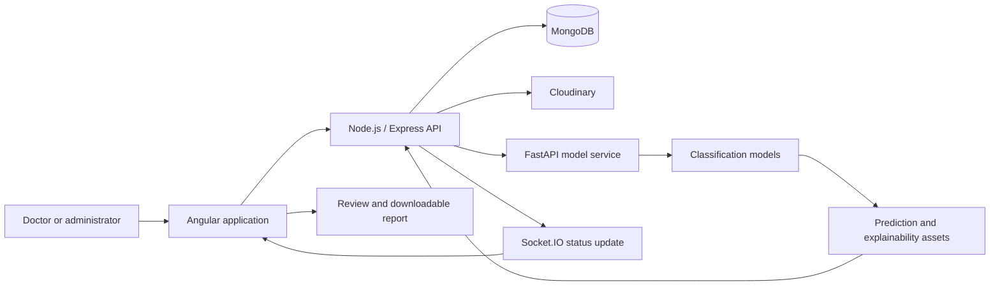

<div align="center">

# ACLyze AI

### Academic full-stack prototype for AI-assisted knee MRI classification and explainability


[](https://angular.dev/)
[](https://nodejs.org/)
[](https://fastapi.tiangolo.com/)
[](https://www.mongodb.com/)

[Watch walkthrough](https://drive.google.com/file/d/11EW5Pg1qPY1VFzozEk9ZudoRi7A1duDX/view?usp=drive_link) · [Frontend demo](https://aclyze-ai-demo.vercel.app) · [Recruiter overview](./RECRUITER_OVERVIEW.md)

</div>

> [!IMPORTANT]
> **Educational and research scope:** ACLyze AI is an academic prototype. It is not a medical device, has not been clinically validated, and must not be used for diagnosis, treatment, or other clinical decisions.

> [!NOTE]
> **Demo availability:** The hosted frontend and supporting services use free-tier infrastructure. Services may sleep, cold-start, expire, or become temporarily unavailable. The walkthrough, screenshots, repositories, architecture, and local setup remain available when the end-to-end deployment is offline.

## Overview

ACLyze AI demonstrates an end-to-end medical-imaging workflow connecting:

- an Angular web application for upload, review, dashboards, and reporting;
- a Node.js and Express API for users, authorization, files, reports, and events;
- a FastAPI service that exposes trained knee-MRI classification models;
- MongoDB and Cloudinary for application data and generated assets;
- Socket.IO for asynchronous status and result updates.

The product was developed as a graduation project and received an **A grade**. Its purpose is to demonstrate software architecture, AI-service integration, explainability-oriented UI, and multi-role workflows—not to claim clinical readiness.

## Shawky Elsayed's contribution

Shawky contributed across the full-stack product integration, including:

- Angular workflows for MRI upload, processing states, result review, dashboards, and reports;
- Node.js API features for JWT authentication, role-based authorization, users, scans, and reports;
- integration with the external FastAPI model service;
- display of predictions and heatmap-style explainability outputs;
- Socket.IO-driven status updates;
- Cloudinary-backed asset handling and downloadable report flows;
- responsive UI implementation, GSAP motion, and API documentation.

This was a team project. Commit history and repository ownership remain the source of truth for exact individual implementation details.

## Product workflow



## Main capabilities

| Area | Implemented capability |
| --- | --- |
| Authentication | JWT-based login, protected routes, and role-aware access |
| MRI workflow | Upload, processing state, result retrieval, and history |
| AI integration | FastAPI service invocation and structured result handling |
| Explainability | Heatmap-style assets and confidence-oriented result presentation |
| Administration | User, model, and platform-management interfaces |
| Reporting | Generated report data and downloadable report workflows |
| Real time | Socket.IO updates for processing and application events |
| Media | Cloudinary-backed image and report asset handling |
| UX | Responsive Angular interface, loading states, and GSAP motion |

## Screenshots and walkthrough


The walkthrough is the most reliable way to inspect the complete flow when free hosted services are asleep or unavailable:

- [Watch the full demonstration](https://drive.google.com/file/d/11EW5Pg1qPY1VFzozEk9ZudoRi7A1duDX/view?usp=drive_link)

## Technology stack

### Frontend

- Angular 17+
- TypeScript and RxJS
- GSAP
- Role-aware routing and guards
- Responsive dashboards and forms

### Backend

- Node.js and Express.js
- MongoDB and Mongoose
- JWT and role-based authorization
- Socket.IO
- Cloudinary
- PDF/report generation

### AI service

- Python and FastAPI
- PyTorch-based model integration
- Multi-view MRI input handling
- Explainability/heatmap generation
- Structured API responses

## Related repositories

- [Knee MRI model and FastAPI service](https://github.com/shawky2002020/Knee-MRI-Model)

## Running locally

### Prerequisites

- Current Node.js LTS release
- Angular CLI compatible with the project
- MongoDB connection
- Cloudinary credentials for hosted assets
- Running FastAPI model service

### Web application

```bash
git clone https://github.com/shawky2002020/Knee-MRI-AI-Analysis.git
cd Knee-MRI-AI-Analysis
npm install
```

Review the repository folders and environment examples for the frontend and API commands used by the project.

### Model service

Follow the setup instructions in the [Knee-MRI-Model repository](https://github.com/shawky2002020/Knee-MRI-Model).

## Demo and deployment status

| Surface | Status |
| --- | --- |
| Frontend URL | Free-tier deployment; may be asleep or unavailable |
| Node.js API | Requires configured environment and hosted service |
| FastAPI model service | Resource-intensive; not guaranteed to remain continuously hosted on free infrastructure |
| Walkthrough video | Recommended stable product demonstration |
| Source repositories | Public and available for technical review |

A dead or slow hosted link should not be treated as a claim that the application is continuously operated in production. This repository documents an academic system and provides reproducible source and setup information.

## Known limitations

- No clinical validation or regulatory review
- Model performance depends on dataset quality, split methodology, and selected thresholds
- Free hosted services can sleep or stop
- Medical predictions require qualified human review
- Some end-to-end integrations require private environment variables and third-party accounts

## Responsible-use statement

ACLyze AI should be evaluated as a software-engineering and AI-integration project. Outputs are experimental model predictions, not medical conclusions.

## License and academic use

This repository is provided for educational and portfolio review. Confirm dataset, model, and third-party licensing before reuse or commercial deployment.
