<div align="center">

# ACLyze AI

### Deep Learning Knee MRI Analysis & Explainability Platform

<p align="center">
  <strong>An academic full-stack medical imaging platform connecting Angular 17, Node.js/Express, MongoDB, and FastAPI/PyTorch microservices for multi-view MRI injury detection, Grad-CAM attention heatmaps, automated clinical reporting, and role-based administration.</strong>
</p>

[](https://angular.dev/)
[](https://www.typescriptlang.org/)
[](https://nodejs.org/)
[](https://expressjs.com/)
[](https://www.mongodb.com/)
[](https://fastapi.tiangolo.com/)
[](https://pytorch.org/)
[](https://socket.io/)
[](https://playwright.dev/)

<p align="center">
  <a href="#-portfolio-demo-video">▶ Watch Demo (94s)</a> &bull;
  <a href="#-visual-product-tour">📸 Product Tour</a> &bull;
  <a href="#-system-architecture">🏗 Architecture</a> &bull;
  <a href="#-engineering-highlights">⚡ Engineering Highlights</a> &bull;
  <a href="#-run-locally">🚀 Run Locally</a> &bull;
  <a href="#-my-contribution">👨‍💻 My Contribution</a>
</p>

</div>

---

> [!IMPORTANT]
> **Academic Prototype & Responsible Use Notice**  
> ACLyze AI was conceived and developed as an undergraduate graduation capstone project at **Ain Shams University (Awarded Grade A)** exploring deep learning and explainable computer vision (Grad-CAM) in musculoskeletal MRI analysis. It is an **educational software prototype**, has **not** undergone clinical trials or regulatory medical-device certification (FDA/CE), and is **not intended for autonomous clinical diagnosis or patient treatment planning**.

> [!TIP]
> **Zero-Downtime Local Demonstration Stack**  
> Remote free-tier cloud deployments frequently sleep, expire, or throttle database traffic. To enable immediate, deterministic technical evaluation by recruiters and hiring managers, this repository includes an autonomous **local demo engine** with an in-memory/JSON data adapter (`localDbAdapter.mjs`), a standalone FastAPI model simulator, and a complete synthetic patient dataset with zero PII.

---

## 📹 Portfolio Demo Video

A verified Full HD walkthrough demonstrating end-to-end clinician intake, multi-view slice upload, Grad-CAM explainability comparison, case history archiving, and administrative RBAC.

> 🎬 **94-Second Product Walkthrough**  
> *Hero & Landing &rarr; Doctor Authentication &rarr; Dashboard Metrics &rarr; Patient Demographic Intake &rarr; Multi-View MRI Upload &rarr; Grad-CAM Explainability Heatmap &rarr; Case Archive &rarr; Administrative RBAC & Institutional Analytics*

| Video Specification | Verified Metric |
| :--- | :--- |
| **Direct Repository Path** | [`portfolio/demo/aclyze-ai-cv-demo.mp4`](portfolio/demo/aclyze-ai-cv-demo.mp4) |
| **Duration** | `93.57 seconds` (1 min 34s) |
| **Resolution & Framerate** | `1920x1080` (1080p Full HD) @ `30.0 fps` |
| **Encoding & Audio** | `H.264 (High Profile, yuv420p)` &bull; `AAC Stereo (44.1 kHz)` |
| **File Size** | `12.52 MB` |
| **Hosted Reference Links** | [Watch Google Drive Walkthrough](https://drive.google.com/file/d/11EW5Pg1qPY1VFzozEk9ZudoRi7A1duDX/view?usp=drive_link) &bull; [Vercel Frontend Demo](https://aclyze-ai-demo.vercel.app) *(Subject to free-tier cloud availability)* |

---

## 🖥️ Clinician Workspace Overview

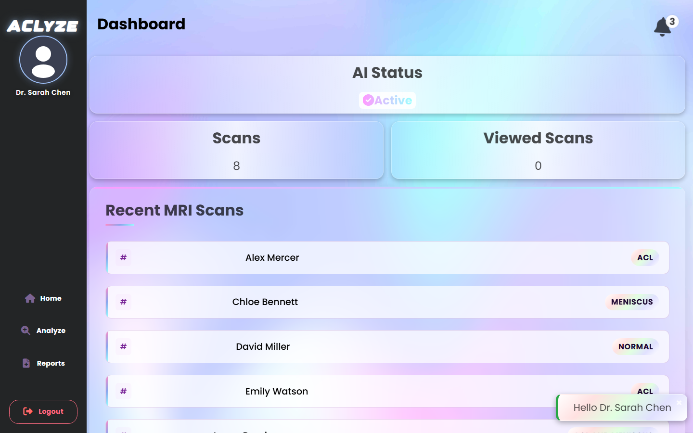

*Figure 1: Clinician Operational Dashboard (`/app/dashboard`) displaying active AI microservice health, total scan throughput, and recent patient triage cases with diagnostic classification badges.*

---

## 📑 Table of Contents

- [Executive Summary](#-executive-summary)
- [Engineering Highlights](#-engineering-highlights)
- [Visual Product Tour](#-visual-product-tour)
  - [1. Public Portal & Clinician Onboarding](#1-public-portal--clinician-onboarding)
  - [2. Clinician Workspace & Patient Intake](#2-clinician-workspace--patient-intake)
  - [3. Deep AI Analysis & Grad-CAM Explainability](#3-deep-ai-analysis--grad-cam-explainability)
  - [4. Case History & Clinical PDF Reporting](#4-case-history--clinical-pdf-reporting)
  - [5. Institutional Administration & RBAC](#5-institutional-administration--rbac)
  - [6. Responsive Cross-Platform Interface](#6-responsive-cross-platform-interface)
- [System Architecture](#-system-architecture)
- [MRI Analysis Sequence Workflow](#-mri-analysis-sequence-workflow)
- [Authentication & Role-Based Access Control](#-authentication--role-based-access-control)
- [Feature Matrix](#-feature-matrix)
- [Technology Stack](#-technology-stack)
- [My Contribution](#-my-contribution)
- [Reproducible Portfolio Demo Environment](#-reproducible-portfolio-demo-environment)
- [Run Locally (3-Terminal Guide)](#-run-locally)
- [Testing & Quality Verification](#-testing--quality-verification)
- [Repository Structure](#-repository-structure)
- [Complete Screenshot Gallery](#-complete-screenshot-gallery)
- [Responsible Use & Limitations](#-responsible-use--limitations)

---

## 💡 Executive Summary

Musculoskeletal injuries—specifically **Anterior Cruciate Ligament (ACL)** and **meniscus tears**—represent some of the most prevalent orthopedic pathologies requiring magnetic resonance imaging (MRI). Interpreting knee MRIs is cognitive-heavy, time-intensive, and prone to diagnostic latency in high-volume trauma settings.

**ACLyze AI** explores an end-to-end clinical workflow that bridges deep learning with healthcare software engineering:
1. **Multi-View Computer Vision:** Ingests slices across **Axial**, **Coronal**, and **Sagittal** planes to capture three-dimensional joint morphology using deep convolutional backbones (ResNet).
2. **Explainable AI (Grad-CAM):** Synthesizes gradient-weighted class activation maps, overlaying high-attention heatmaps directly over the cruciate ligament and meniscus regions to assist radiologists in verifying model focus.
3. **Decoupled Asynchronous Microservices:** Pairs an asynchronous Python FastAPI inference microservice with an Express.js coordination layer, Socket.IO push notifications, and headless Puppeteer clinical PDF generation.
4. **Institutional Role Separation:** Enforces strict Role-Based Access Control (RBAC) isolating radiologist clinical workflows from administrative user lifecycle management and institutional pathology analytics.

---

## ⚡ Engineering Highlights

- **Full-Stack TypeScript & Modern Angular:** Single-Page Application engineered with Angular 17.3, reactive RxJS streams, custom CSS glassmorphism, and GSAP micro-animations.
- **Asynchronous FastAPI Model Gateway:** Decoupled REST microservice handling multi-view image tensors, NumPy normalization, and deep feature aggregation.
- **Explainability Centerpiece (Grad-CAM):** Interactive UI allowing clinicians to toggle between raw high-resolution MRI scans and heatmaps highlighting specific injured tissue coordinates.
- **Strict Role-Based Access Control (RBAC):** Cryptographically signed JWTs and backend middleware enforcing isolation between Doctor (`/app/*`) and Administrator (`/admin/*`) domains with automatic 403 enforcement.
- **Headless Automated Clinical Reporting:** Server-side Puppeteer engine generating structured, printable PDF summaries containing patient demographics, AI confidence scores, and visual overlays.
- **Real-Time WebSockets:** Socket.IO pipeline pushing background inference progress and institutional event notifications to active clinician sessions.
- **Zero-Downtime Deterministic Demo Engine:** Custom in-memory database adapter (`localDbAdapter.mjs`) replicating Firebase RTDB/MongoDB APIs with zero external network dependencies for 100% test reproducibility.
- **Automated Verification Harness:** 9 automated E2E API contract tests, Playwright multi-viewport screenshot automation, and FFmpeg Full HD video transcoding pipelines.

---

## 📸 Visual Product Tour

### 1. Public Portal & Clinician Onboarding

The landing experience articulates the clinical problem statement, diagnostic triage pipeline, and interactive platform FAQ before directing clinicians to secure authentication.

<table>
  <tr>
    <td colspan="2">
      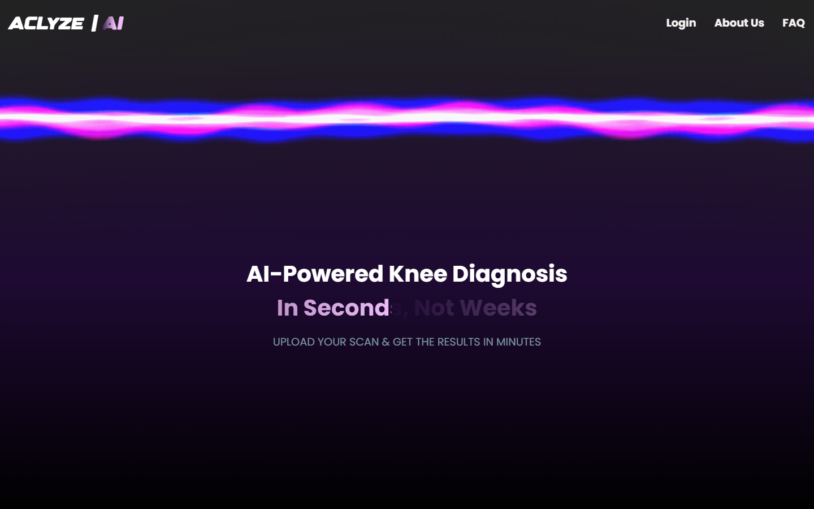
      <p align="center"><em>Landing Portal: Clinical challenge overview, explainability showcase, and responsive navigation.</em></p>
    </td>
  </tr>
  <tr>
    <td width="50%">
      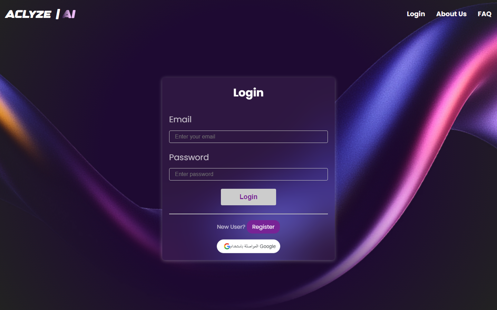
      <p align="center"><em>Clinician Authentication: JWT login with bcrypt verification.</em></p>
    </td>
    <td width="50%">
      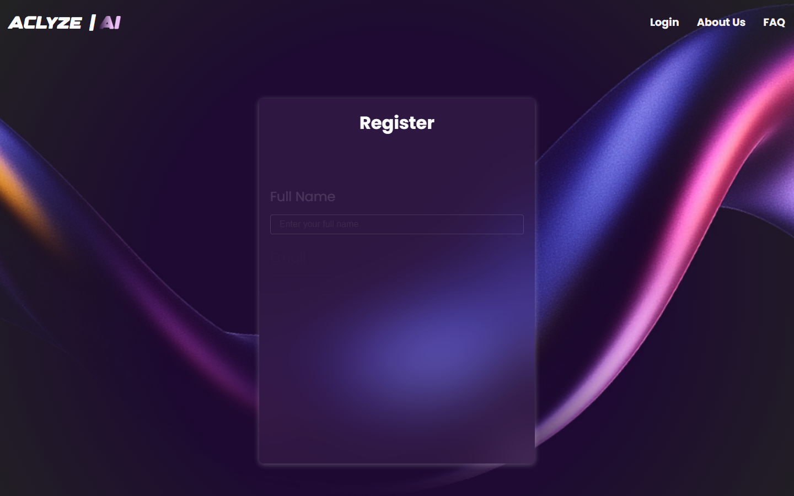
      <p align="center"><em>User Onboarding: Account creation with input validation.</em></p>
    </td>
  </tr>
</table>

---

### 2. Clinician Workspace & Patient Intake

Clinicians access personalized operational dashboards providing real-time AI microservice health checks, active case counters, and direct demographic intake forms.

<table>
  <tr>
    <td width="50%">
      
      <p align="center"><em>Clinician Dashboard: Active AI status, scan volume counters, and live patient queue.</em></p>
    </td>
    <td width="50%">
      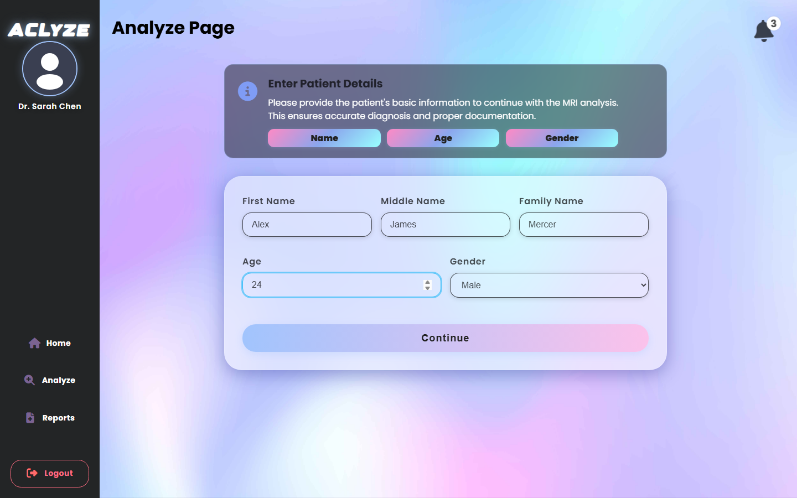
      <p align="center"><em>Patient Demographic Intake: Reactive Angular form with strict validation.</em></p>
    </td>
  </tr>
</table>

---

### 3. Deep AI Analysis & Grad-CAM Explainability

The diagnostic result screen serves as the clinical core of ACLyze AI. To mitigate "black-box" machine learning concerns, clinicians can interactively toggle between the raw anatomical MRI scan and the **Grad-CAM attention heatmap**, directly visualizing the spatial regions that influenced the model's classification.

<table>
  <tr>
    <td width="50%">
      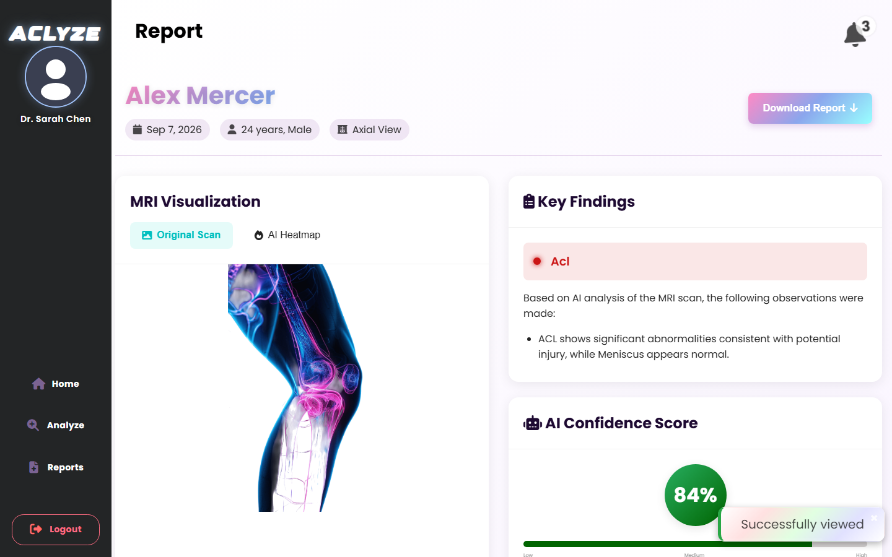
      <p align="center"><strong>Original Scan Tab:</strong> Raw anatomical knee MRI, calibrated 84% confidence gauge, and clinical findings summary.</p>
    </td>
    <td width="50%">
      
      <p align="center"><strong>AI Heatmap Tab:</strong> Grad-CAM attention overlay highlighting high-activation coordinates across the cruciate ligament.</p>
    </td>
  </tr>
</table>

> [!NOTE]
> **Clinical XAI Context:** Grad-CAM (Gradient-weighted Class Activation Mapping) calculates gradients of the classification score with respect to the final convolutional layer's feature maps. Visual attention maps are intended to aid human radiologist audit—not to guarantee pathology.

---

### 4. Case History & Clinical PDF Reporting

Clinicians can review historical patient records, filter cases by tear classification (Normal, ACL, Meniscus, Both), and generate formal clinical documentation via automated headless PDF synthesis.

<table>
  <tr>
    <td width="50%">
      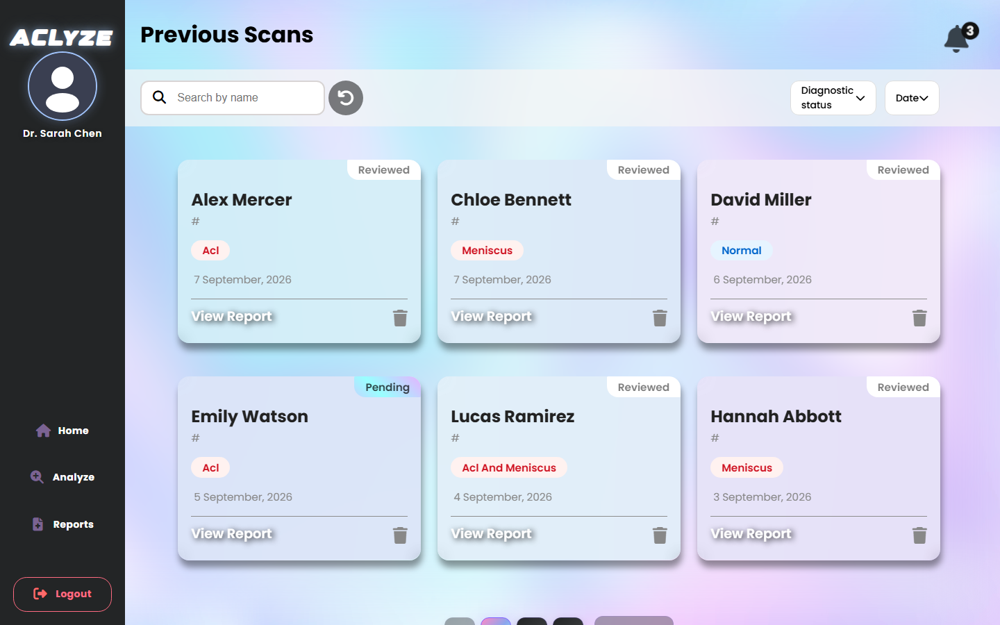
      <p align="center"><em>Case Archive: Filterable directory of historical cases with diagnostic status tags.</em></p>
    </td>
    <td width="50%">
      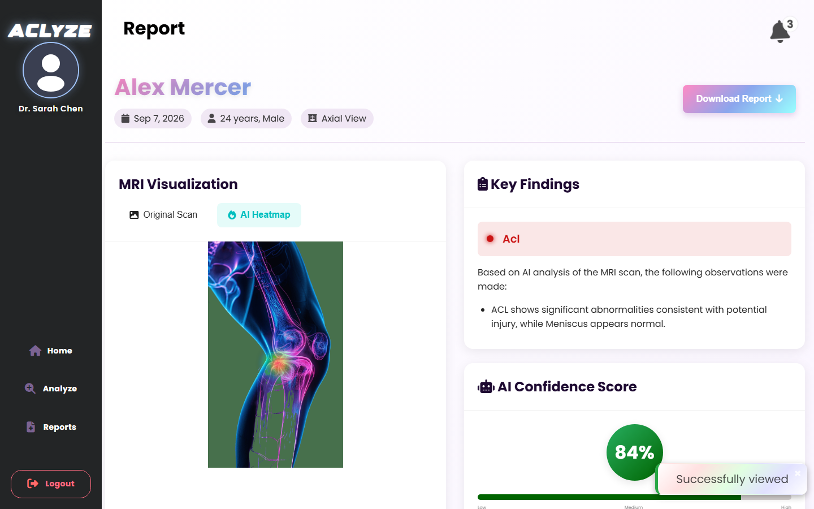
      <p align="center"><em>Clinical Summary: Detailed diagnostic observations and PDF export CTA.</em></p>
    </td>
  </tr>
</table>

---

### 5. Institutional Administration & RBAC

Administrators oversee hospital-wide throughput, monitor diagnostic classification distributions (ACL Tears vs Meniscus Tears vs Normal), and control user role assignments.

<table>
  <tr>
    <td width="50%">
      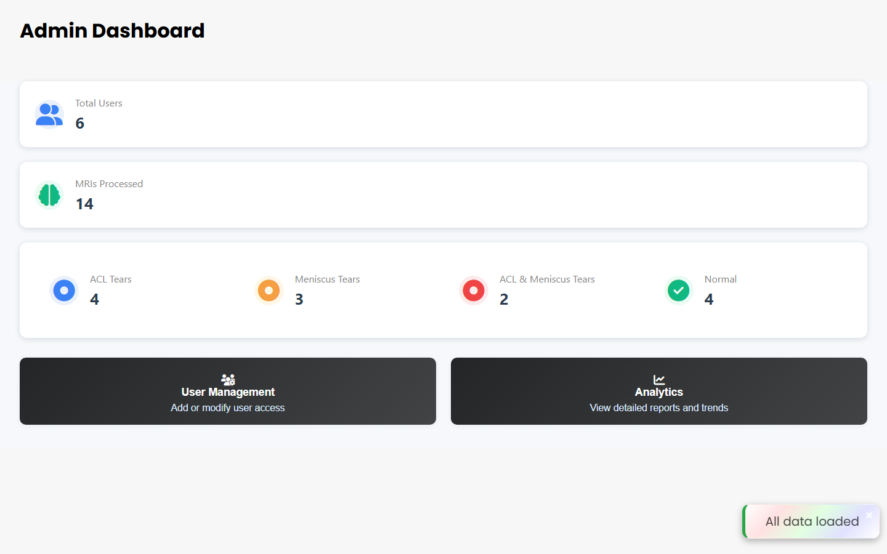
      <p align="center"><em>Administrative Dashboard: Institutional scan volume, active users, and diagnosis breakdown.</em></p>
    </td>
    <td width="50%">
      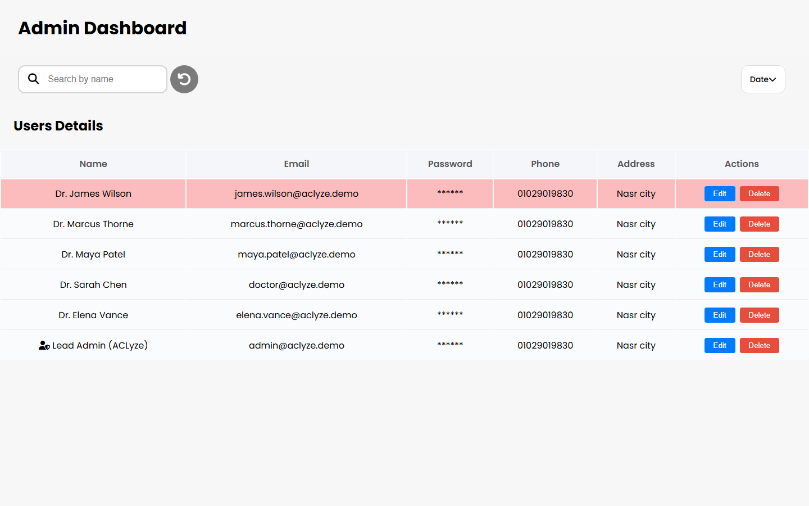
      <p align="center"><em>User Management: Clinician roster, role modification, and access authorization.</em></p>
    </td>
  </tr>
  <tr>
    <td colspan="2">
      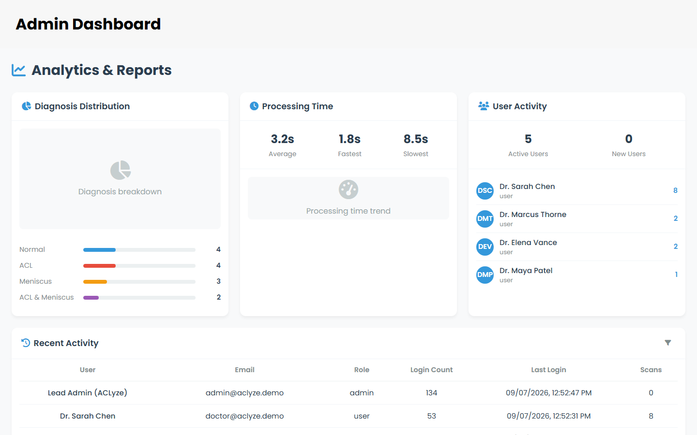
      <p align="center"><em>Diagnostic Distribution Analytics: Aggregated platform-level pathology breakdown.</em></p>
    </td>
  </tr>
</table>

---

### 6. Responsive Cross-Platform Interface

The application layout adapts fluidly across viewports, featuring mobile drawer navigation, stacked metric cards, and responsive image viewing.

<table>
  <tr>
    <td width="33%">
      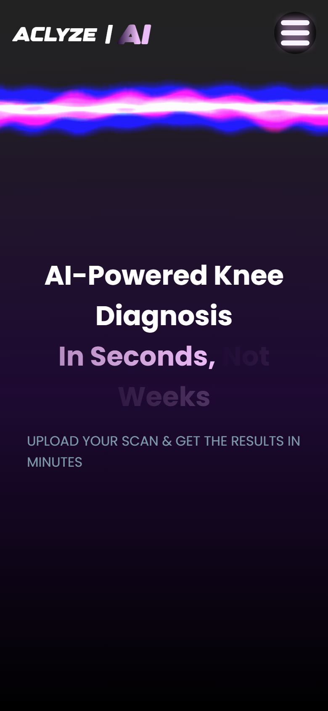
      <p align="center"><em>Mobile Landing</em></p>
    </td>
    <td width="33%">
      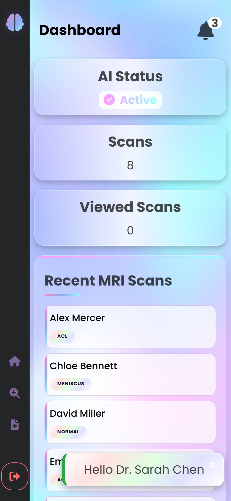
      <p align="center"><em>Mobile Dashboard</em></p>
    </td>
    <td width="33%">
      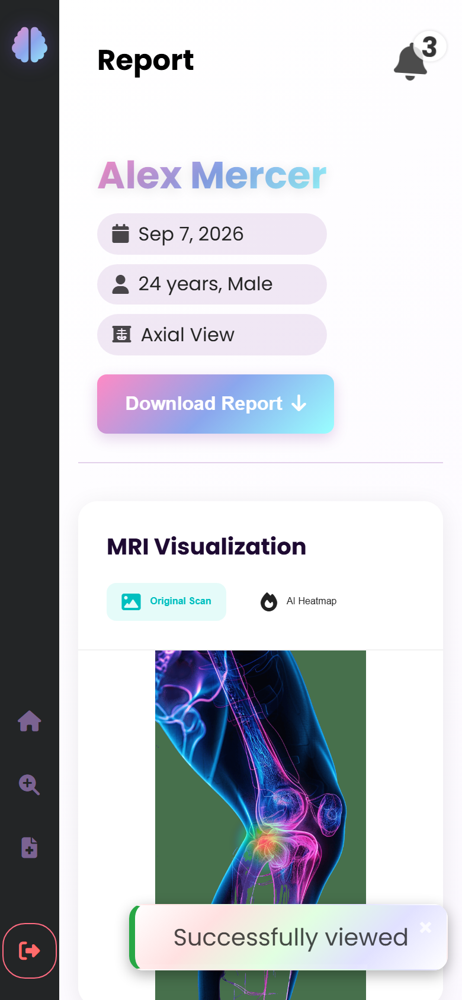
      <p align="center"><em>Mobile Diagnostic View</em></p>
    </td>
  </tr>
</table>

---

## 🏗️ System Architecture

ACLyze AI implements a decoupled three-tier microservice architecture separating client presentation, coordination/authorization, and deep learning inference:

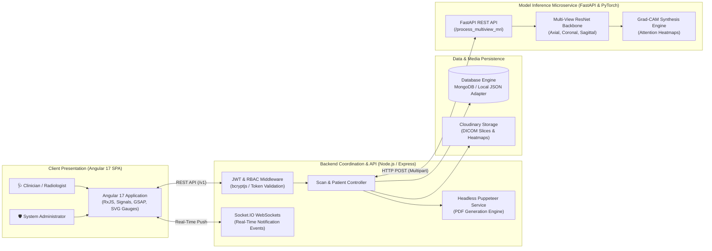

### Architectural Boundaries
1. **Client Tier (Angular 17.3):** Single-page application utilizing route guards (`AuthGuard`), HTTP interceptors (`AuthInterceptor`), reactive forms, and responsive CSS grid architectures.
2. **Coordination Tier (Express 4.21):** Modular REST API exposing versioned `/v1/*` endpoints. Enforces authentication, role authorization, database query transformations, and asynchronous job dispatch.
3. **Inference Tier (FastAPI & PyTorch):** Dedicated computer vision microservice receiving multi-view slice tensors, running forward inference through ResNet backbones, and computing gradient activations.
4. **Data & Media Tier:** Manages document schemas (users, scans, notifications) and binary asset storage (scans, generated heatmaps, clinical PDFs).

---

## 🔄 MRI Analysis Sequence Workflow

The sequence diagram below details the asynchronous lifecycle of an MRI scan from clinician upload to multi-view inference, real-time push notification, and report generation:

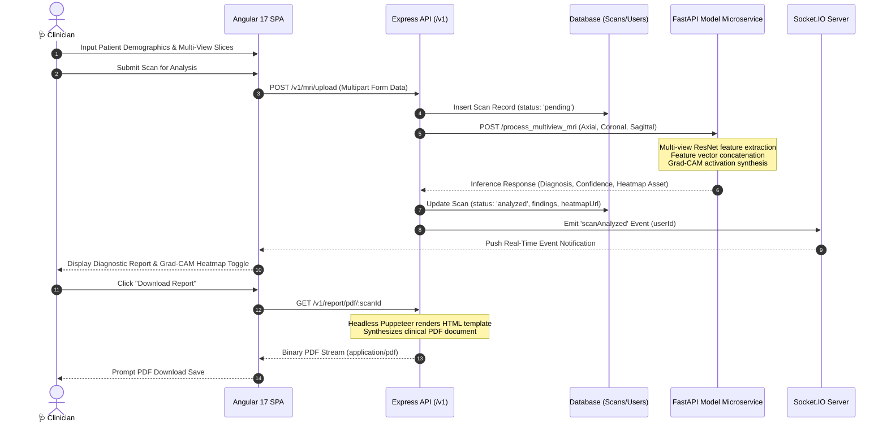

---

## 🔒 Authentication & Role-Based Access Control

ACLyze AI implements strict Role-Based Access Control (RBAC) at both the Angular route guard level and the backend Express middleware level:

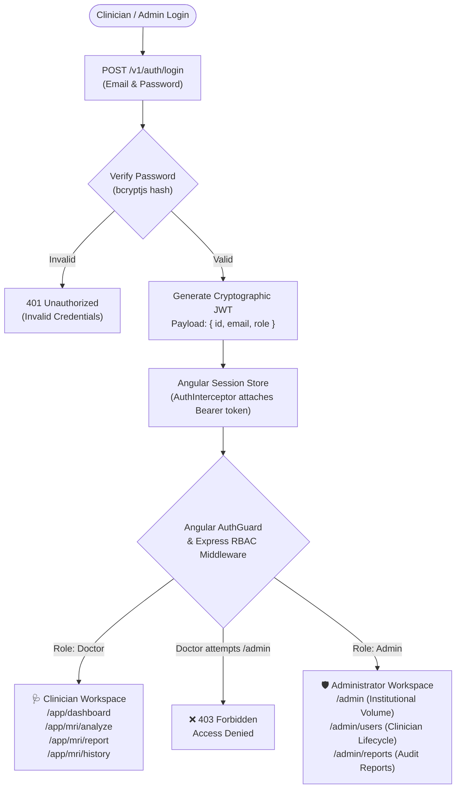

| Security Dimension | Implementation |
| :--- | :--- |
| **Token Standard** | Stateless JSON Web Tokens (JWT) signed with HMAC-SHA256 |
| **Credential Hashing** | Adaptive `bcryptjs` with configurable salt rounds |
| **Route Protection** | Angular `canActivate: [AuthGuard]` preventing unauthenticated route loading |
| **RBAC Enforcement** | Express `authGuard` middleware validating token claims before controller dispatch |
| **Data Isolation** | Clinicians only query their assigned scans; Administrators query aggregate institutional metrics |

---

## 📊 Feature Matrix

| Functional Area | Implemented Capability | Source Verification |
| :--- | :--- | :--- |
| **Authentication** | Email/password login, registration, JWT issuance, Google OAuth token verification | `backend/controllers/authController.mjs` |
| **Role Authorization** | Granular Doctor vs Admin roles with backend 403 route guards | `backend/middleware/authMiddleware.mjs` |
| **Multi-View MRI** | Intake across Axial, Coronal, and Sagittal slice orientations | `frontend/src/app/features/mri/` |
| **AI Inference** | Asynchronous invocation of `/process_multiview_mri` microservice | `backend/controllers/modelController.mjs` |
| **Explainable AI** | Grad-CAM activation heatmap generation with interactive client toggle | `frontend/src/app/features/mri/report/` |
| **Automated PDF** | Headless Puppeteer engine synthesizing clinical summaries with image overlays | `backend/controllers/reportController.mjs` |
| **Real-Time Push** | Socket.IO server pushing scan completion and unread notification alerts | `backend/server.mjs`, `notification.service.ts` |
| **Case Archive** | Filterable, searchable historical scan directory with diagnosis tags | `frontend/src/app/features/mri/history/` |
| **Admin Management**| Institutional scan volume aggregation and clinician role modification | `backend/controllers/adminController.mjs` |
| **Asset Storage** | Hybrid local filesystem and Cloudinary cloud storage adapter support | `backend/config/cloudinary.mjs` |
| **Demo Automation** | In-memory/JSON local DB, FastAPI simulator, 16 Playwright screenshots, 1080p MP4 | `backend/config/localDbAdapter.mjs`, `portfolio/` |

---

## 💻 Technology Stack

```
Frontend Architecture (Single-Page Application)
├── Framework:        Angular 17.3 (Component architecture, standalone components)
├── Language:         TypeScript 5.4 (Strict typing)
├── Reactive State:   RxJS 7.8 (Observables, BehaviorSubjects)
├── Motion & Styling: GSAP 3.12, Custom Vanilla CSS Glassmorphism
└── Real-Time Client: Socket.IO Client 4.8

Backend & Coordination API
├── Runtime:          Node.js (v18+ / v22.x LTS)
├── Web Framework:    Express.js 4.21 (REST architecture, modular routing)
├── Authentication:   JSON Web Tokens (jsonwebtoken 9.0), bcryptjs 2.4
├── Report Engine:    Puppeteer 24.1 (Headless Chromium PDF printing), PDFKit 0.17
├── Database Engine:  MongoDB 6.10 / Mongoose 8.8 / LocalDbAdapter 1.0 (Demo mode)
├── File Uploads:     Multer 1.4 (Multipart form streaming)
└── Asset Hosting:    Cloudinary SDK 2.5 (Supported cloud adapter)

Deep Learning & Inference Microservice
├── Microservice:     FastAPI 0.115 / Uvicorn (Asynchronous ASGI server)
├── ML Framework:     PyTorch 2.x (Convolutional Residual Networks)
├── Architecture:     Multi-View ResNet (Axial, Coronal, Sagittal backbones)
├── Explainability:   Grad-CAM (Gradient-weighted Class Activation Mapping)
└── Scientific Stack: NumPy, SciPy, Pillow (Image transformations)

Testing, Verification & Media Production
├── End-to-End Suite: Playwright 1.58 (Automated browser testing & capture)
├── Media Pipeline:   FFmpeg 8.1.1 (Full HD H.264 transcoding, AAC synthesis)
├── Stream Validation:FFprobe 8.1.1 (Automated codec, framerate, and duration validation)
└── API Contracts:    Node.js native test runner (demo/test_api_contracts.mjs)
```

---

## 👨‍💻 My Contribution

ACLyze AI was developed as a collaborative graduation capstone project at **Ain Shams University** (Faculty of Engineering / Computer Science), receiving an **A Grade**. Repository ownership and Git commit history remain the definitive source of truth for individual contributions.

**Shawky Elsayed's Core Responsibilities & Contributions:**
- **Full-Stack Architectural Design:** Architected the decoupled microservices boundary connecting the Angular frontend, Node.js coordination API, and Python inference endpoints.
- **Frontend Product Development:** Implemented the Angular 17 application, including reactive patient intake forms, diagnostic results visualization, radial SVG confidence gauges, and GSAP UI transitions.
- **Explainability Integration:** Designed and implemented the client-side Grad-CAM toggle allowing clinicians to inspect spatial attention overlays against raw DICOM slices.
- **Node.js API & RBAC:** Implemented JWT authentication, bcrypt password hashing, role-based authorization middleware, and scan query controllers.
- **Automated Clinical Reporting:** Developed the server-side Puppeteer workflow generating formatted, downloadable clinical PDF summaries.
- **Portfolio Demonstration Engineering:** Created the zero-downtime local demo environment (`localDbAdapter.mjs`), FastAPI simulator (`demo/model_simulator.py`), deterministic synthetic data pipelines, Playwright automation suites, and FFmpeg video pipeline.

---

## 🛡️ Reproducible Portfolio Demo Environment

To ensure reliable evaluation by recruiters and hiring managers without relying on sleeping free-tier cloud containers or expired third-party credentials, this repository includes an isolated demonstration architecture:

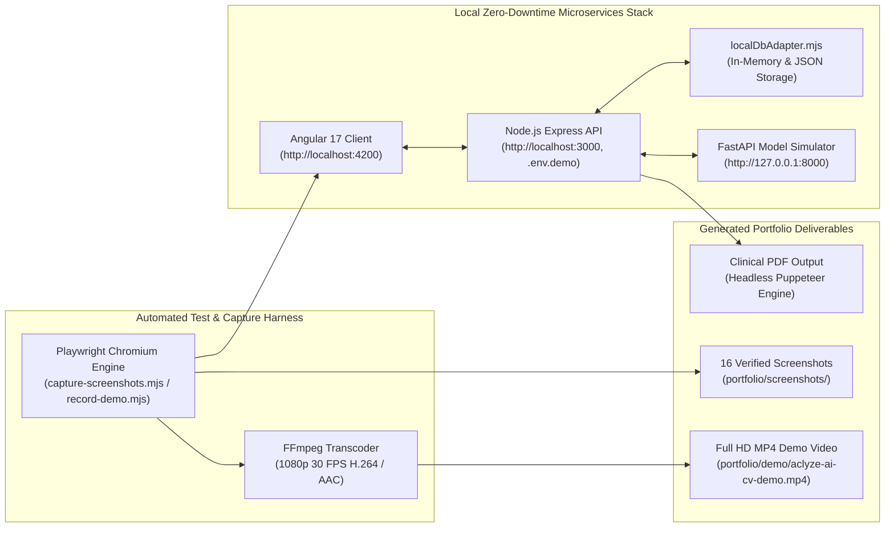

### Deterministic Demo Accounts
All accounts use fictional, synthetic credentials isolated strictly to local testing:

| Role | Demo Email | Demo Password | Primary Permissions |
| :--- | :--- | :--- | :--- |
| **Doctor / Clinician** | `doctor@aclyze.demo` | `DoctorDemo2026!` | Patient intake, multi-view MRI upload, Grad-CAM toggle, PDF download |
| **Administrator** | `admin@aclyze.demo` | `AdminDemo2026!` | Institutional scan metrics, pathology distribution analytics, user management |

---

## 🚀 Run Locally

Experience the complete application locally with zero cloud dependencies.

### Prerequisites
- **Node.js**: `v18.x` or `v20.x` LTS
- **Python**: `3.10+` with `pip`
- **Modern Web Browser**: Chrome, Edge, or Firefox

---

### Step 1: Launch FastAPI Model Simulator
In Terminal 1:
```bash
# From repository root
python demo/model_simulator.py
```
*Healthcheck:* Simulator starts listening on `http://127.0.0.1:8000` (docs available at `/docs`).

---

### Step 2: Launch Node.js Backend API
In Terminal 2:
```bash
cd backend
npm install
npm run demo:reset    # Deterministically seeds 6 users and 13 multi-view MRI cases
npm run demo          # Boots backend in demo mode on http://localhost:3000
```

---

### Step 3: Launch Angular Frontend
In Terminal 3:
```bash
cd frontend
npm install
npx ng serve --port 4200
```
Navigate your browser to **`http://localhost:4200`** and log in with the demo credentials above.

---

### Step 4: Run Automated Verification Suites (Optional)
```bash
# Execute 9 E2E API contract tests (Auth, Scans, RBAC 403, Admin Stats, Puppeteer PDF)
node demo/test_api_contracts.mjs

# Re-run Playwright automated screenshot capture (16 desktop & mobile views)
node portfolio/demo/capture-screenshots.mjs

# Re-record Full HD 1080p MP4 walkthrough video
node portfolio/demo/record-demo.mjs
```

---

## 🧪 Testing & Quality Verification

| Test Suite / Validation Step | Execution Target | Outcome | Status |
| :--- | :--- | :--- | :---: |
| **API Contract: Health & DB** | `GET /v1/auth/profile` | In-memory DB mounted, returns expected auth challenge | ✅ Passed |
| **API Contract: Doctor Login**| `POST /v1/auth/login` | Returns valid JWT containing `role: 'doctor'` | ✅ Passed |
| **API Contract: Scan Retrieval**| `GET /v1/mri/scans` | Returns 8 assigned scans with patient metadata | ✅ Passed |
| **API Contract: RBAC 403 Guard**| `GET /v1/admin/users` (Doctor Token) | Express middleware correctly returns **403 Forbidden** | ✅ Passed |
| **API Contract: Admin Login** | `POST /v1/auth/login` | Returns valid JWT containing `role: 'admin'` | ✅ Passed |
| **API Contract: Admin Stats** | `GET /v1/admin/dashboard` | Returns 14 institutional scans & diagnosis breakdown | ✅ Passed |
| **API Contract: PDF Generation**| `GET /v1/report/pdf/:id` | Puppeteer compiles PDF stream (`Content-Type: application/pdf`) | ✅ Passed |
| **Frontend Production Build** | `npx ng build` | Angular bundle compiles with 0 errors | ✅ Passed |
| **Playwright Screenshot Suite**| `capture-screenshots.mjs` | 16 views captured across Desktop and Mobile viewports | ✅ Passed |
| **Video FFprobe Validation** | `record-demo.mjs` | Verified 1920x1080 @ 30 FPS H.264 / AAC (93.57s duration) | ✅ Passed |

---

## 📁 Repository Structure

```text
Knee-MRI-AI-Analysis/
├── frontend/                        # Angular 17 Client Application
│   ├── src/app/
│   │   ├── core/                    # Singleton services (Auth, User, Scan, Notification)
│   │   ├── features/
│   │   │   ├── auth/                # Login, registration, password recovery
│   │   │   ├── dashboard/           # Clinician overview and scan queue
│   │   │   ├── mri/                 # Intake form, upload dropzone, report, history
│   │   │   ├── admin/               # Administrative metrics, users, institutional reports
│   │   │   └── home/                # Landing portal, clinical timeline, FAQ
│   │   ├── shared/                  # Layouts (HomeLayout, AppLayout, AdminLayout), navbar, sidebar
│   │   └── guards/                  # Angular AuthGuard route protection
│   └── package.json                 # Angular 17.3 dependencies
│
├── backend/                         # Node.js / Express Coordination API
│   ├── config/
│   │   ├── serverConfig.mjs         # Express setup, middleware, Socket.IO binding
│   │   ├── localDbAdapter.mjs       # Zero-latency local in-memory/JSON DB engine
│   │   └── cloudinary.mjs          # Cloudinary asset hosting configuration
│   ├── controllers/                 # authController, scanController, reportController, adminController
│   ├── middleware/                  # authMiddleware (JWT verification & RBAC enforcement)
│   ├── models/                      # User, MriScan, Notification schema definitions
│   ├── routes/                      # Versioned (/v1) route definitions
│   ├── scripts/                     # seedDemoData.mjs and resetDemoData.mjs
│   └── package.json                 # Express 4.21, Puppeteer, JWT dependencies
│
├── demo/                            # Standalone Local Simulation Engine
│   ├── model_simulator.py           # FastAPI service matching Knee-MRI-Model API
│   └── test_api_contracts.mjs       # 9 E2E API contract verification tests
│
├── portfolio/                       # Recruiter & Developer Deliverables
│   ├── demo/
│   │   ├── aclyze-ai-cv-demo.mp4    # Verified Full HD 1080p walkthrough video (94s)
│   │   ├── record-demo.mjs          # Playwright + FFmpeg automated video generator
│   │   ├── intro_card.html          # Title card animation template
│   │   └── outro_card.html          # Engineering architecture outro template
│   ├── screenshots/                 # Complete suite of 16 high-resolution captures
│   ├── DEMO_SETUP.md                # Dedicated step-by-step setup documentation
│   ├── DEMO_SCRIPT.md               # Scene-by-scene script and timing breakdown
│   ├── DEMO_MANIFEST.md             # Complete inventory of generated media assets
│   └── TOOLS_USED.md                # Comprehensive technical tools breakdown
│
├── README.md                        # Primary project documentation
└── RECRUITER_OVERVIEW.md            # Concise executive recruiter summary
```

---

## 🖼️ Complete Screenshot Gallery

<details>
<summary><strong>Click to expand the complete 16-screenshot portfolio inventory</strong></summary>
<br />

| Asset Filename | Viewport | Category | View Description |
| :--- | :---: | :---: | :--- |
| `01-landing-home.png` | `1440x900` | Public | [Public Landing Page](portfolio/screenshots/01-landing-home.png) &bull; Clinical value proposition & FAQ |
| `02-login.png` | `1440x900` | Public | [Clinician Login](portfolio/screenshots/02-login.png) &bull; Email and password authentication |
| `03-register.png` | `1440x900` | Public | [Clinician Register](portfolio/screenshots/03-register.png) &bull; Account registration view |
| `04-doctor-dashboard.png` | `1440x900` | Clinician | [Doctor Dashboard](portfolio/screenshots/04-doctor-dashboard.png) &bull; AI active indicator & patient feed |
| `05-mri-patient-form.png` | `1440x900` | Clinician | [Patient Intake Form](portfolio/screenshots/05-mri-patient-form.png) &bull; Patient demographic fields |
| `06-mri-multi-view-upload.png`| `1440x900` | Clinician | [Multi-View MRI Upload](portfolio/screenshots/06-mri-multi-view-upload.png) &bull; Axial, Coronal, Sagittal dropzones |
| `07-mri-diagnostic-result.png`| `1440x900` | Clinician | [Diagnostic Report (Scan)](portfolio/screenshots/07-mri-diagnostic-result.png) &bull; Raw scan & 84% gauge |
| `08-explainability-heatmap.png`| `1440x900` | Explainability | [Grad-CAM Heatmap](portfolio/screenshots/08-explainability-heatmap.png) &bull; Attention overlay on ligament |
| `09-mri-history.png` | `1440x900` | Clinician | [Case History Directory](portfolio/screenshots/09-mri-history.png) &bull; Filterable scan archive |
| `10-clinical-report-view.png` | `1440x900` | Clinician | [Clinical Summary](portfolio/screenshots/10-clinical-report-view.png) &bull; Findings & PDF export CTA |
| `11-admin-dashboard.png` | `1440x900` | Administration | [Admin Dashboard](portfolio/screenshots/11-admin-dashboard.png) &bull; Institutional metrics & diagnosis breakdown |
| `12-admin-user-management.png`| `1440x900` | Administration | [User Management](portfolio/screenshots/12-admin-user-management.png) &bull; Clinician roster & role toggles |
| `13-admin-reports.png` | `1440x900` | Administration | [Institutional Reports](portfolio/screenshots/13-admin-reports.png) &bull; Pathology distribution analytics |
| `14-mobile-home.png` | `390x844` | Mobile | [Mobile Home](portfolio/screenshots/14-mobile-home.png) &bull; Responsive mobile landing page |
| `15-mobile-doctor-dashboard.png`| `390x844` | Mobile | [Mobile Dashboard](portfolio/screenshots/15-mobile-doctor-dashboard.png) &bull; Stacked metric cards & drawer |
| `16-mobile-mri-result.png` | `390x844` | Mobile | [Mobile Diagnostic View](portfolio/screenshots/16-mobile-mri-result.png) &bull; Responsive heatmap viewer |

</details>

---

## ⚖️ Responsible Use & Limitations

- **Academic Engineering Demonstration:** ACLyze AI demonstrates full-stack software architecture, AI microservice coordination, and explainable computer vision interfaces. It is not an FDA-cleared or CE-marked medical device.
- **Model Assumptions & Limitations:** Deep learning model outputs represent probabilistic classifications subject to training distribution variance, slice artifacts, and imaging plane alignment.
- **Zero Real Patient Data (PII):** All patient records, scan identifiers, names, and timestamps in this demonstration repository are synthetically generated for educational evaluation.
- **Security & Secret Compliance:** All private environment variables (`.env*`) and credentials are strictly excluded via `.gitignore`. The demo environment utilizes deterministic, synthetic mock credentials.

---

## 🔗 Related Repositories & Contact

- **Model & Training Repository:** [`shawky2002020/Knee-MRI-Model`](https://github.com/shawky2002020/Knee-MRI-Model) &bull; PyTorch ResNet training pipelines, MRNet dataset preprocessing, and FastAPI serving endpoints.
- **Author:** **Shawky Elsayed**
  - **GitHub:** [@shawky2002020](https://github.com/shawky2002020)
  - **LinkedIn:** [linkedin.com/in/shawky-elsayed](https://linkedin.com/in/shawky-elsayed)
